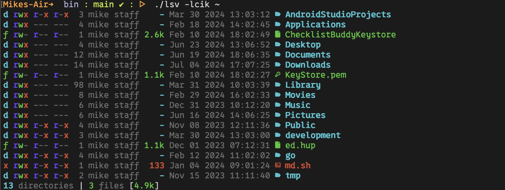

# lsv - Yet another `ls` alternative

`lsv` is modern alternative to `ls` in the spirit of `exa, eza, lsd, pls, natls, ls-go` and others.



## Features

- Single binary with no external dependencies!
- Not written in Rust 😮 (see below)
- Colored output based on LS_COLORS
- Column Headers (long format)
- Nearly as fast as GNU ls
- Robust recursion. Try `lsv -R /`.
- Options similar to `ls`
- Blocked output (long format)
- Shows link origins and follows links (long format)

## Installing

Build `lsv` from source. I plan to have binary releases after beta.

- Install the V compiler. It takes a minute or less
- `git clone ...`
- `cd lsv/lsv`
- `v .` or `v -prod .` for an optimized version

and your done. No kidding, that's it.

## Help
```
lsv 2024.1.beta
-----------------------------------------------
Usage: lsv [options] [FILES]

Description: List information about FILES

Options:
  -a                        include files starting with .
  -c                        color the listing
  -D                        append / to directories
  -m                        list of files separated by commas
  -q                        enclose files in quotes
  -R                        list subdirectories recursively
      --depth <int>         limit depth of recursion
  -X                        list files by lines instead of by columns
  -1                        list one file per line
      --width <int>         set output width to <int>

Filtering and Sorting Options:
  -d                        list only directories
  -f                        list only files
  -g                        group directories before files
  -r                        reverse the listing order
  -s                        sort by file size, largest first
  -t                        sort by time, newest first
  -v                        sort digits within text as numbers
  -w                        sort by width, shortest first
  -x                        sort by file extension
  -u                        no sorting

Long Listing Options:
  -b                        blank line every 5 rows
  -k                        sizes in kibibytes (1024) (e.g. 1k 234m 2g)
  -K                        sizes in Kilobytes (1000) (e.g. 1kb 234mb 2gb)
  -l                        show long listing format
  -L                        show link's origin information
  -o                        show octal permissions
  -p                        show relative path
      --header              show column headers
      --inode               show inodes
      --iso                 show time in iso format
      --no-counts           hide file/dir counts
      --no-date             hide date
      --no-dim              hide shading; useful for light backgrounds
      --no-group            hide group name
      --no-hard-links       hide hard links count
      --no-owner            hide owner name
      --no-permissions      hide permissions
      --no-size             hide file size

  -h, --help                display this help and exit
  --version                 output version information and exit

The -c option emits color codes when standard output is
connected to a terminal. Colors are defined in the LS_COLORS 
environment variable. To set colors, use the dircolors command.
```

## Why?

I started writing an `ls` implemention for the V Languages CoreUtils project.
Coreutils is a reimplementation of the POSIX and GNU utility programs written in the V Language. Everything was going fine until I started having too much fun and down the, "Rabbit Hole" I went.

What's this V language? You can read about it here but the short version is it a simple, fast, safe, compiled language developing maintainable software. I mentioned `lsv` is not written in Rust. I'm not trashing Rust. It is obviously a robust and popular language. However, it's a steep climb to get up to speed and requires a fair bit of cognitive load to use it well.

V is the opposite. It has many of the same safty features of Rust, but without the cognitive over head. It's simple, straightfoward syntax makes it a breeze to write. Compiles happen in milliseconds, not minutes and hours. And you don't need any special build helpers like Gradle.

`lsv` exists not because I wanted to write another file lister, but because it was so much darn fun writing is in V. I get the same giddy feeling writing code in V as I did 40 years ago when I first discovered C.

So yeah, I'm a V fan boy, but after 40+ years of programming, I find it so refreshing to go back something so easy and enjoyable.

Finally, take a look at the 'lsv' code base. The entire code base is **1.2 lines** 🧐. Furthermore, the implemention is straightforward. No threading or coroutines. You don't even need to know V to understand the code (provided you have programmed in other languages of course).

## Helping Out

See CONTRIBUTING.md for more information