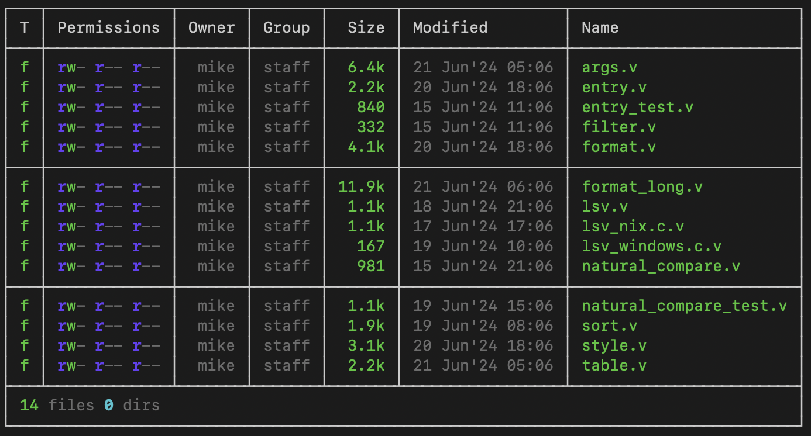

# lsv - A Vlang implementation of `ls`

`lsv` is a modern alternative to `ls` in the spirit of `exa, eza, lsd, pls, natls, ls-go` and others.


Border format with header option


## Features

- Single binary with no external dependencies!
- Not written in Rust 😮 (see below)
- Color output based on LS_COLORS
- Table format (long format)
- Column Headers (long format)
- Blocked output (long format)
- Checksum (md5, sha1, sha224, sha256, sha512, blake2b)
- Friendly file sizes and dates
- Nearly as fast as GNU `ls`
- Robust recursion. Try `lsv -R /`.
- Options similar to `ls`
- Usual other `ls` features

## Installing

### Build `lsv` from source.

- [Install the V compiler](https://docs.vlang.io/installing-v-from-source.html). It takes a minute or less
- `git clone https://github.com/mike-ward/lsv.git`
- `cd lsv`
- `make`
- `bin/lsv`

### Binaries

[Latest Release](https://github.com/mike-ward/lsv/releases/latest)

## Help
```
lsv 2024.1
-----------------------------------------------
Usage: lsv [options] [FILES]

Description: List information about FILES

Options:
  -a                        include files starting with .
  -c                        color the listing
  -D                        append / to directories
  -m                        list of files separated by commas
  -q                        enclose files in quotes
  -R                        list subdirectories recursively
      --depth <int>         limit depth of recursion
  -X                        list files by lines instead of by columns
  -1                        list one file per line
      --width <int>         set output width to <int>

Filtering and Sorting Options:
  -d                        list only directories
  -f                        list only files
  -g                        group directories before files
  -r                        reverse the listing order
  -s                        sort by file size, largest first
  -t                        sort by time, newest first
  -v                        sort digits within text as numbers
  -w                        sort by width, shortest first
  -x                        sort by file extension
  -u                        no sorting

Long Listing Options:
  -b                        blank line every 5 rows
  -B                        add borders to long listing format
  -k                        sizes in kibibytes (1024) (e.g. 1k 234m 2g)
  -K                        sizes in Kilobytes (1000) (e.g. 1kb 234mb 2gb)
  -l                        long listing format
  -o                        show octal permissions
  -p                        show relative path
  -A                        show last accessed date
  -C                        show last status changed date
  -H                        show column headers
  -I                        show time in iso format
  -J                        show time in compact format
  -L                        show link's origin information
  -N                        show inodes
      --cs <string>         show file checksum
                            (md5, sha1, sha224, sha256, sha512, blake2b)

      --no-counts           hide file/dir counts
      --no-date             hide date (modified)
      --no-dim              hide shading; useful for light backgrounds
      --no-group            hide group name
      --no-hard-links       hide hard links count
      --no-owner            hide owner name
      --no-permissions      hide permissions
      --no-size             hide file size

  -h, --help                display this help and exit
  --version                 output version information and exit

The -c option emits color codes when standard output is
connected to a terminal. Colors are defined in the LS_COLORS
environment variable.
```

## Why?

It started with writing a `ls` implemention for the V Language CoreUtils project.
Coreutils is a reimplementation of the POSIX and GNU utility programs written in the V Language. Everything was going fine until I started having too much fun and down the, "Rabbit Hole" I went.

What's this V language? You can read about it [here](https://vlang.io/), but the short version is it is a simple, fast, safe, compiled language for developing maintainable software. I mentioned `lsv` is not written in Rust. I'm not trashing Rust. Rust is obviously a robust and popular language. However, it's a steep climb to get up to speed and requires a fair bit of cognitive load to use it well.

V is the opposite. It has many of the same safty features of Rust, but without the cognitive over head. It's simple, straightfoward syntax makes it a breeze to write. Builds happen in milliseconds, not minutes and hours. You don't need any special build tools like Gradle.

Finally, take a look at the `lsv` code base. The entire code base is **1.5K lines** 🧐. Furthermore, the implemention is straightforward. No threading, coroutines or fancy memory management. Even if you don't know V, I'm betting you will understand the code.

## Helping Out

See CONTRIBUTING.md for more information
